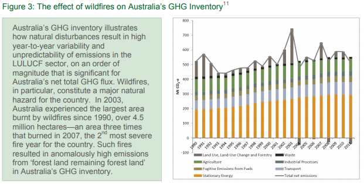

# Data Landscape

## GHG Emissions

Honing in on indicator 13.2.2 "total greenhouse gas emissions per year" under the target of 13.2 which calls to "Integrate climate change measures into national policies, strategies and planning" will help us better understand the narrative that this data is telling. By collecting data on GHG emissions it is possible to understand our anthropogenic emissions rates, to ensure we make appropriate emissions reductions goals, and are hitting the interim targets necessary to meet the goals. The data for this indicator is self reported per country by means of self interrogation and calculation of greenhouse gas emissions using a framework and disaggregation provided by the UNFCCC. Once calculated and collected, the national GHG inventories are then submitted to the Climate Change secretariat.

There are two frameworks for data collection and reporting methodologies defined for Annex and Non-Annex countries because. This distinction is generated because even though the countries are formally equal in the United Nations climate negotiations it is recognized that, "their contribution to greenhouse gas (GHG) emissions, development needs, and vulnerability to climate change vary greatly."[@Pauw2019] Thus within the UN Framework Convention on Climate Change (UNFCCC), 'common but differentiated responsibilities and respective capabilities' (CBDR-RC) were acknowledged through distinctions such as the Annex vs Non-Annex designation." Annex I Parties were committed to adopting national policies and measures with the non-legally binding aim to return their greenhouse gas (GHG) emissions to 1990 levels by 2000. The group is largely similar to the Annex B Parties to the Kyoto Protocol that also adopted emissions reduction targets for 2008--2012. By default, the other countries are referred to as Non-Annex I Parties."[@Allwood2014]

Additionally there are Annex 2 countries that "have a special obligation to provide financial resources to meet the agreed full incremental costs of implementing measures mentioned under Article 12, paragraph 1. They are also obliged to provide financial resources, including for the transfer of technology, to meet the agreed incremental costs of implementing measures covered by Article 12, paragraph 1 and agreed between developing country Parties and international entities referred to in Article 11 of the UNFCCC. This group of countries shall also assist countries that are particularly vulnerable to the adverse effects of climate change."[@Allwood2014] The main difference in that "Non-Annex I Parties (developing countries) are not required to submit a separate annual greenhouse gas inventory, and their national communications are not subject to in-depth reviews."[@UNFCCC2009] It is recognized that many "developing countries still face reporting challenges, notably the least developed countries (LDCs), which in view of their lack of resources are not required to submit their national communications within a specified period."[@UNFCCC2009]

The framework to collect the metadata for 13.2.2 consists of required disaggregation of reported data by both economic sector and type of gas, and by two distinct scopes of emissions definitions, with and without land use change and forestry (LULUCF). "The land use sector comprises land use, land use change and forestry (LULUCF) and agriculture, sometimes referred to collectively as agriculture, forestry and other land use (AFOLU)."[@Iversen2014]

The UNFCCC's data collection methodology accounts for emissions by these two distinct frameworks because of the complex relationship and unclear boundary between anthropogenic and non anthropogenic **sources** and **sinks** and "unlike other sectors, land use includes both emissions (source) and removals (sinks) of CO~2~. For many developed countries forest land is a net sink, although for a few it constitutes a net source."[@Iversen2014] It is important to remember that "the exchange of greenhouse gases between land and the atmosphere takes place regardless of human activities, but can also be impacted by anthropogenic activities, i.e. the land reservoir of carbon can be increased or decreased due to human activities within the limits of available land area, nutrients, precipitation and wind which all determine boundaries for sequestration of CO2. " Additional data collection issues arise due to the difficulty of trying to "distinguish causal factors in the land sector that result in emissions or removals. For example, emissions from fires may originate from either natural causes (e.g. climate cycles, lightning), or indirect and direct human causes (e.g. past forest harvest activities, unintended spread of deliberately set fires or, in some parts of the world, climate change), or a combination of causes."[@Paustian2006]

A source is a source of greenhouse gases molecules into the atmosphere such as a coal fired power plant burning coal and the emissions from the burn are a source of greenhouse gasses to the atmosphere where a sink is something that removes greenhouse gases from the atmosphere, such as a tree via photosynthesis removes carbon from the atmosphere.

```{r ghg-inventory, fig.cap="Example of text box with figure[@Iversen2014]", echo=FALSE, fig.id = "ghg"}


```

The motivation behind the required disaggregation of data by gas type is because of the variety of greenhouse gasses, such as carbon dioxide, methane, and nitrous oxide, their varied global warming potentials, and the various ways that each molecule cycles through the earth's systems. For example, carbon cycles through the atmosphere and organic matter through what is known as the carbon cycle, via plants and animals respiration, humans burning organic matter for energy, wildfires, just to name a few. Understanding how much methane is emitted, unique from other gasses, could empower sequestration for that gas. The methodology provided by the UNFCCC to report "total GHG emissions are such that to calculated as the sum of emissions of direct GHGs: carbon dioxide (CO~2~), methane (CH~4~), nitrous oxide (N~2~O), perfluorocarbons (PFCs), hydrofluorocarbons (HFCs), sulphur hexafluoride (SF~6~) and nitrogen trifluoride (NF~3~), measured in units of CO~2~-equivalent, by using a common weighting factor, the so-called Global Warming Potentials (GWP)."[@UnitedNations2020] The weighting of emissions based on its global warming potential is an important step in the collection process due to the dissimilar warming impact that each greenhouse gas molecule has. For example one molecule of methane has the potential to warm the atmosphere four times higher than a molecule of carbon dioxide due to the nature of its molecular properties. 

