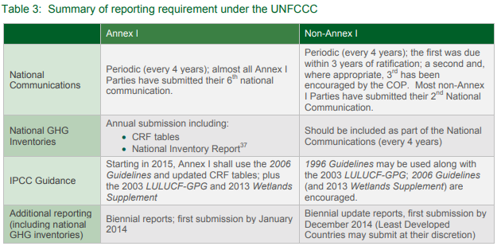

# Politics of Numbers

## GHG Emissions

The politics of numbers around the sustainable development goal 13.2.2 presents itself in many ways. For example, "reductions" in greenhouse gasses cannot be ensured without adequate collection of net greenhouse gasses emissions data because of the nature of the goal. The word "reduction" implies reducing something relative to a pre-existing amount. If we do not know what the pre-existing amount was of the thing we are trying to measure we cannot measure a "reduction" of that something. This need to measure a "reduction in" greenhouse gas emissions to avert catastrophic climate change prescribes the space for data manipulation due to political interests in all international climate treaty frameworks when establishing the baseline counterfactual. Additionally when we say we need to "not only reduce anthropogenic greenhouse gas emissions but also sequestering ***enough*** greenhouse gasses that have been emitted into the atmosphere since the industrial revolution." What does enough mean? Due to the complex nature of climate physics and technological evolution, scientists have not come to a complete consensus on the definition of enough, thus breeding a space for political manipulation of data hidden in the ambiguity of the word and lack of a precise number defining enough.

Collecting proper and complete GHG emissions data, we can establish a baseline level of emissions and thus ensure we are achieving emissions reductions, and we can ensure that we sequester enough emissions to stay below the Paris Agreements goal of 1.5 degrees Celsius, and define the word enough in a numeric and precise way. A baseline is defined as:[@Allwood2014]

> "The state against which change is measured. In the context of transformation pathways, the term 'baseline scenarios' refers to scenarios that are based on the assumption that no mitigation policies or measures will be implemented beyond those that are already in force and/or are legislated or planned to be adopted. Baseline scenarios are not intended to be predictions of the future, but rather counterfactual constructions that can serve to highlight the level of emissions that would occur without further policy effort. Typically, baseline scenarios are then compared to mitigation scenarios that are constructed to meet different goals for greenhouse gas (GHG) emissions, atmospheric concentrations, or temperature change. The term 'baseline scenario' is used interchangeably with reference scenario' and 'no policy scenario'."

This need for a baseline level of emissions was solved through the IPCC's First Assessment Report, mentioned earlier in the chapter.

The first international climate treaty, the Kyoto Protocol, was followed by the first comprehensive climate and emissions report in 1990, published in 1991. This was a necessary order of operations because we cannot get countries to measure emissions reductions next to a level that we do not know due to lack of data. Publishing the report in 1991 allowed countries to be held accountable. For the first time the technical capacity to allocate responsibility differently for countries proportional to the amount of cumulative emissions that they have contributed existed. This now proven and understood differentiation in responsibility inspired Kyoto to allocate differentiated emissions reductions goals to different countries.

One way that this was built in was the choice in base year:[@UNFCCC2021d]

> "Base year emissions, under the Kyoto Protocol, are defined as the aggregate anthropogenic carbon dioxide equivalent emissions of the GHGs listed in Annex A sources in a historical base year. For most Annex I Parties, the historical base year is 1990 but Parties included in Annex I undergoing the process of transition to a market economy may choose a year or period other than 1990, in accordance with Article 3, paragraph 5. Annex I Parties may choose to use 1995 as the base year for total emissions of hydrofluorocarbons (HFCs), perfluorocarbons (PFCs) and sulphur hexafluoride (SF~6~), in accordance with Article 3, paragraph 8 and 1995 or 2000 as its base year for nitrogen trifluoride (NF~3~) in accordance with Article 3, paragraph 8 bis of Doha Amendment to the Kyoto Protocol."

This choice in base year is a way to quickly skew data narratives. If a country has a goal to reduce emissions relative to 1995 levels vs 1990 levels and they have higher emissions in 1995, the goal reductions goals will be much easier to meet while on the contrary it addresses previous injustices and more fairly allocates emissions responsibilities to the historic emitters.

The differentiated nature of goals for countries empowered some to reject the treaties because of "unfair" reductions targets relative to other countries. The reporting framework put forth in the Paris Climate Agreement, "The Enhanced Transparency Framework", was structured in a way to alleviate some of the political motivation behind reporting emissions data because there was no mandatory target to be achieved but rather "nationally determined contributions". The emphasis on this framework was moved from reducing emissions numbers to transparency in reporting of accurate data.

The metadata is self reported from each member country through estimates and calculations which "mostly follow one of a few publicly available protocols.[@Schultz2014] [@GCoM2018] It is extremely difficult to get exact measurements of emissions due to things like unknown natural gas leakage also known as "runaway methane leakage", etc. To exacerbate data collection issues, there is no systematic, peer-reviewed assessment of self reported emissions data quality or accuracy."[@Gurney2021] This is problematic because this could easily lead to differences in definitions and scopes for reporting emissions per entity.

Some challenges associated with self reported emissions data arises due to the high burden placed on the individual city due to the high cost of the endeavor and the technical challenges associated with the calculation and modeling necessary to estimate the data. This could result in incomplete estimates or biased outcomes. "Compounding the problem, independent objective assessment of emissions estimates creates additional technical hurdles and is thus, rarely attempted. These challenges are particularly important when placed in the context of the reduction targets. For example, the city of Indianapolis has indicated that they aim to make a 20% reduction in building GHG emissions between by 2025 relative to 2016 values.[@IndianapolisOfficeofSustainability] However, with the 26.9% underestimate found here, it will be difficult to know when and if this target is truly achieved or track progress towards it."[@Gurney2021]

"Accuracy and precision are critical to estimating GHG emissions, whether reported by a city, state, or country. The absence of an accurate emissions assessment (i.e., baseline and ongoing) makes prioritizing mitigation policy options difficult, can lead to misallocation of scarce mitigation resources, and presents challenges to independent assessment and course correction. Fortunately, there is progress on building a systematic emissions quantification system that promises a systematic approach to generating space/time-resolved, atmospherically calibrated emissions information for all cities in collaboration with local authorities. With such a collaborative system, urban GHG mitigation practitioners can devote time and resources to the activity they have the greatest knowledge and political influence over: the best mitigation strategies for their city or country."

```{r ghg-reporting, fig.cap="Example of text box with figure[@Iversen2014]", echo=FALSE, fig.id = "ghg-table"}


```