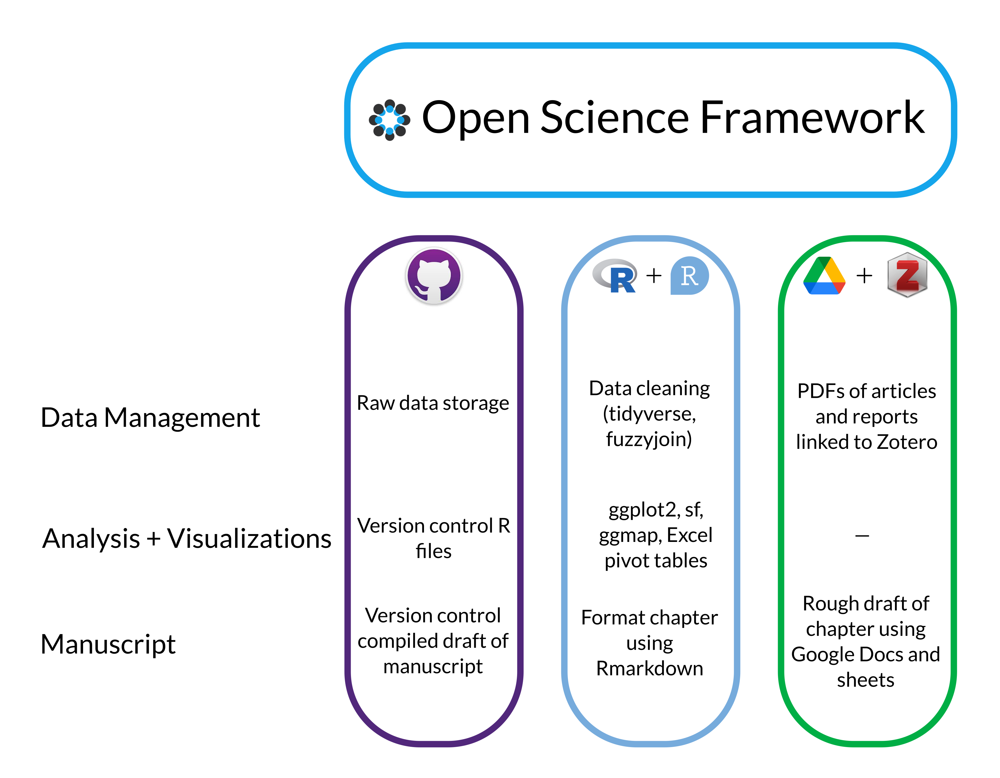

# Climate Change

## Abstract

Climate change data are vast and multi-faceted. This module uses official greenhouse gas emissions (GHG) inventories as a proxy to explore how various disaggregation of climate change data can paint different narratives in the global conversation on climate. In this module we will help students understand how emissions vary across regions and play a role in climate negotiations that could impact the trajectory of international cooperation.

In this module the students will learn how to access and retrieve raw data on emissions from the UNFCCC database and prepare it for analysis using data wrangling techniques and best practices. Through this specific process, students will learn about the timeliness and reliability of data by exploring missing data and how to report on it.

The next section will ask to create several visualizations that look at how emissions can be aggregated differently and how these different aggregations can skew narratives of responsibility and mitigation efforts. They will explore the difference between reporting on CO2 exclusively versus complete GHG emissions inventories.

## Repository Structure

The repository is organized such that each part of the data workflow has its own subdirectory.

- 📄 [README.md](README.md)
- 📂 __bibliography__
   - 📄 [README.md](bibliography/README.md)
   - 📄 [chicago\-fullnote\-bibliography\-with\-ibid.csl](bibliography/chicago-fullnote-bibliography-with-ibid.csl)
   - 📄 [climate\-change.bib](bibliography/climate-change.bib)
- 📂 __data__
   - 📄 [README.md](data/README.md)
   - 📄 [annual\-net\-emissions\-removals\-annex\-i\-raw.xlsx](data/annual-net-emissions-removals-annex-i-raw.xlsx)
   - 📄 [annual\-net\-emissions\-removals\-non\-annex\-i\-raw.xlsx](data/annual-net-emissions-removals-non-annex-i-raw.xlsx)
- 📂 __demo__
   - 📄 [README.md](demo/README.md)
   - 📄 [demo\-rmd\-file.Rmd](demo/demo-rmd-file.Rmd)
   - 📄 [rstudio.png](demo/rstudio.png)
- 📂 __images__
- 📂 __problem\-set__
   - 📄 `TODO` [README.md](problem-set/README.md)
   - 📄 [memo.Rmd](problem-set/memo.Rmd)
- 📂 __scripts__
   - 📄 `TODO` [README.md](scripts/README.md)
   - 📂 __analysis__
      - 📄 `TODO` [README.md](scripts/analysis/README.md)
      - 📄 `TODO` [unfccc\-emissions\-analysis.Rmd](scripts/analysis/unfccc-emissions-analysis.Rmd)
      - 📄 [unfccc\-emissions\-analysis.docx](scripts/analysis/unfccc-emissions-analysis.docx)
      - 📄 [unfccc\-emissions\-clean.csv](scripts/analysis/unfccc-emissions-clean.csv)
   - 📂 __cleaning__
      - 📄 [README.md](scripts/cleaning/README.md)
      - 📄 [unfccc\-emissions\-clean.R](scripts/cleaning/unfccc-emissions-clean.R)
      - 📄 [unfccc\-emissions\-clean.Rmd](scripts/cleaning/unfccc-emissions-clean.Rmd)
      - 📄 [unfccc\-emissions\-clean.csv](scripts/cleaning/unfccc-emissions-clean.csv)
      - 📄 [unfccc\-emissions\-clean.docx](scripts/cleaning/unfccc-emissions-clean.docx)
   - 📂 __visualization__
      - 📄 `TODO` [README.md](scripts/visualization/README.md)
      - 📄 `TODO` [unfccc\-emissions\-visualizations.Rmd](scripts/visualization/unfccc-emissions-visualizations.Rmd)
      - 📄 [unfccc\-emissions\-visualizations.docx](scripts/visualization/unfccc-emissions-visualizations.docx)
- 📂 __templates__
   - 📄 [README.md](templates/README.md)
   - 📄 [memo\_template.docx](templates/memo_template.docx)
   - 📄 [template.docx](templates/template.docx)

## Data workflow

