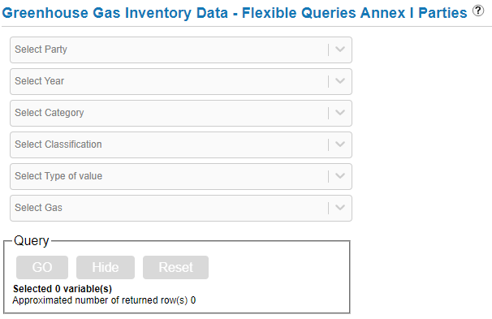

# Introduction

We've collected data on country emissions from the United Nations Framework Convention on Climate Change's (UNFCCC) Greenhouse gas (GHG) [Data Interface](https://di.unfccc.int/) website. We've specifically conducted 'Flexible queries' both for [Annex I](https://di.unfccc.int/flex_annex1) and [Non-Annex I](https://di.unfccc.int/flex_non_annex1) parties to collect data on different types of GHG emissions as well as three types of general statistics: population, land size, and nominal GDP is US$ billions.

Details on how to use the interface and query specific data can be found [here](https://unfccc.int/process-and-meetings/transparency-and-reporting/greenhouse-gas-data/data-interface-help#eq-7). The website also provides higher-level information on major variables, and we will go in detail below on the types of variables we will focus on for this module.

# Directory Contents

| File Name                                          |  Content                        |
|----------------------------------------------------|---------------------------------|
| annual-net-emissions-removals-annex-i-raw.xlsx     | Raw data of GHG and CO2 inventories by Annex I party members and Land Use, Land-Use Change and Forestry (LULUCF) inclusion criteria from each member's base year to 2018.|
| annual-net-emissions-removals-non-annex-i-raw.xlsx | Raw data of GHG and CO2 inventories by Non-Annex I party members and Land Use, Land-Use Change and Forestry (LULUCF) inclusion criteria from 1990 to 2018.|
| UNFCCC-Emissions-clean.csv                         | Final UNFCCC GHG inventories dataset in long format|
| UNFCCC-Emissions-clean.R                           | R script to produce final UNFCCC GHG inventories dataset|
| UNFCCC-Emissions.docx                              | Word document tutorial on data cleaning and wrangling UNFCCC raw dataset|
| UNFCCC-Emissions.Rmd                               | R markdown tutorial on data cleaning and wrangling UNFCCC raw dataset|

# GHG Emissions

Generally speaking, there are six steps required to query the raw dataset that is provided in this module. The data collected in this module is as of **April 12, 2021**.

## Annex I

The following [steps](https://di.unfccc.int/flex_annex1) are for each drop-down menu as shown in the figure below.

1.  **Select Party**: Click on the circle above 'Annex I'

2.  **Select Year**: 'Select All'

3.  **Select Category**: 'Total GHG emissions without LULUCF' and 'Total GHG emissions with LULUCF'

4.  **Select Classification**: 'Total for Category'

5.  **Select Type of Value**: 'Net emissions/removals'

6.  **Select Gas**: 'Aggregate GHGs' and 'CO2.' 

Once the query is submitted and you see the table go to the 'Unit' tab and unselect 'kt,' which means all your GHG emissions values are in kilotonnes or kt CO2 equivalent.

## Non-Annex I

The Non-Annex I [steps](https://di.unfccc.int/flex_non_annex1) are similar to the previous steps for Annex I except for the following:

-   **Select Party**: 'Select All'

-   **Select Category**: 'Total GHG emissions excluding LULUCF/LUCF' and 'Total GHG emissions including LULUCF/LUCF'

Once the query is submitted and you see the table go to the 'Unit' tab and unselect 'Gg,' which means all your GHG emissions values are in Gigagrams or Gg CO2 equivalent.

Please note that 1 kt = 1 Gg.

# Codebook

The following codebook is for the clean dataset called `unfccc-emissions-clean.csv`.

| Variable      | Description     | Unit of measurement | Data type     | Notes        |
| -----------   | -----------     | ------------------- | ------------- | ------------ |
| `party`       | Territory name  | Not applicable      | Categorical   |              |
| `type`        | Emissions that include or exclude Land Use, Land-Use Change and Forestry (LULUCF)| Not applicable | Categorical |      |
| `year`        | Gregorian year  | Annual year         | Categorical   |              |
| `ghg`         | Total GHG emissions | kt or Gg of CO2 equivalent | Numerical | GHG include the following:   1. Carbon dioxide (CO2)   2. Methane (CH4)   3. Nitrous oxide (N2)   4. Hydrofluorocarbons (HFCs)   5. Perfluorocarbons (PFCs)   6. Sulphur Hexafluoride (SF6) |
| `co2`         | Total CO2 emissions | kt or Gg of CO2 | Numerical | Only measures CO2 emissions |